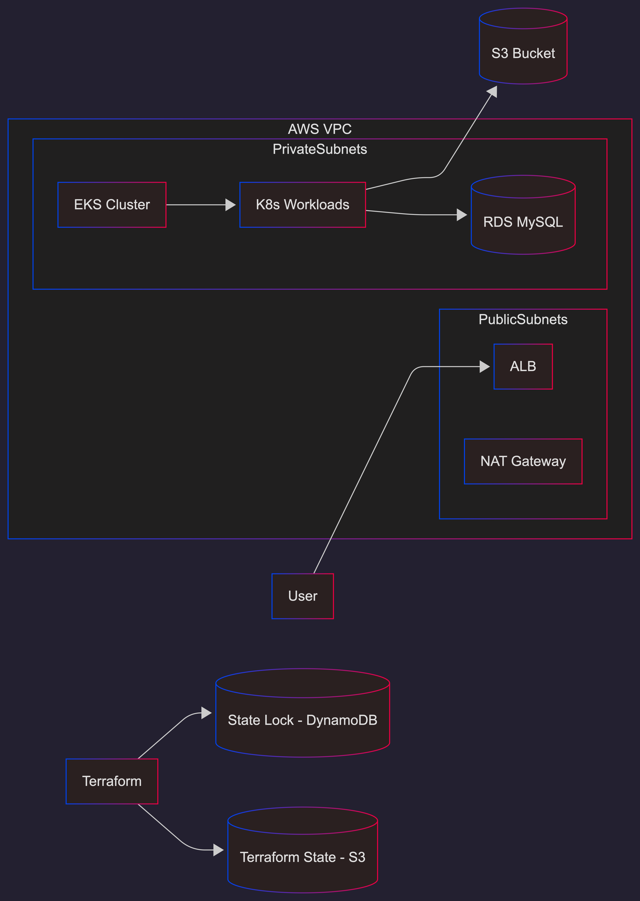

# 🚀 Production-Grade AWS Infrastructure with Terraform

This repository contains a **production-ready Terraform Infrastructure as Code (IaC)** setup used by modern startups to provision scalable, secure, and cost-optimized AWS infrastructure.

---

## 🎯 Project Goals

- Fully automated AWS infrastructure using Terraform
- Environment isolation (dev / staging / production)
- Reusable Terraform modules
- Cost-aware cloud design
- CI-based validation and plan approval
- Remote backend with state locking

## 🔐 Security Practices

- Private subnets for EKS and RDS
- Least-privilege IAM roles
- No hardcoded secrets
- Terraform remote state encryption
- Environment-level isolation

